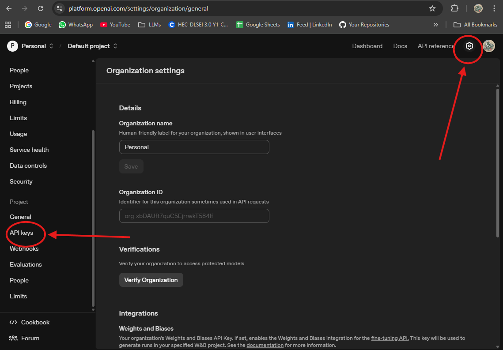

## 🔑 Getting an OpenAI API Key

OpenAI provides access to powerful models like **GPT-5**, **GPT-4** **GPT-4o-mini** and more via its API.  
Follow the steps below to generate your own API key:

---

### 🪜 Step-by-Step Guide

#### 🧭 1. Sign Up or Log In
- Go to the OpenAI Platform [**https://platform.openai.com**](https://platform.openai.com/).  
- Create a **free account** or **log in** if you already have one.

---

#### ⚙️ 2. Navigate to API Keys
- After logging in, click **⚙️ Settings** near your  **profile icon** .  
- Select **"API keys"**  
- Or directly visit 👉 [https://platform.openai.com/api-keys](https://platform.openai.com/api-keys)

---

#### 🧩 3. Create a New API Key
- Click the **➕ "Create new secret key"** button.  
- (Optional) Give your key a name for easy identification.  
- Copy the generated key and **store it somewhere safe** — you **won’t be able to view it again!**

---

### ⚠️ Important Notes
- 🪙 You may need to **add payment details** for higher usage limits.  
- 🔒 **Keep your API key private** — never share it or upload it to public repositories.  
- 💡 It’s a good idea to store your key in an environment variable, like `.env`, instead of hardcoding it.

---

✅ **You’re all set!**  
You can now use your API key in your Python, JavaScript, or SDK-based projects.
