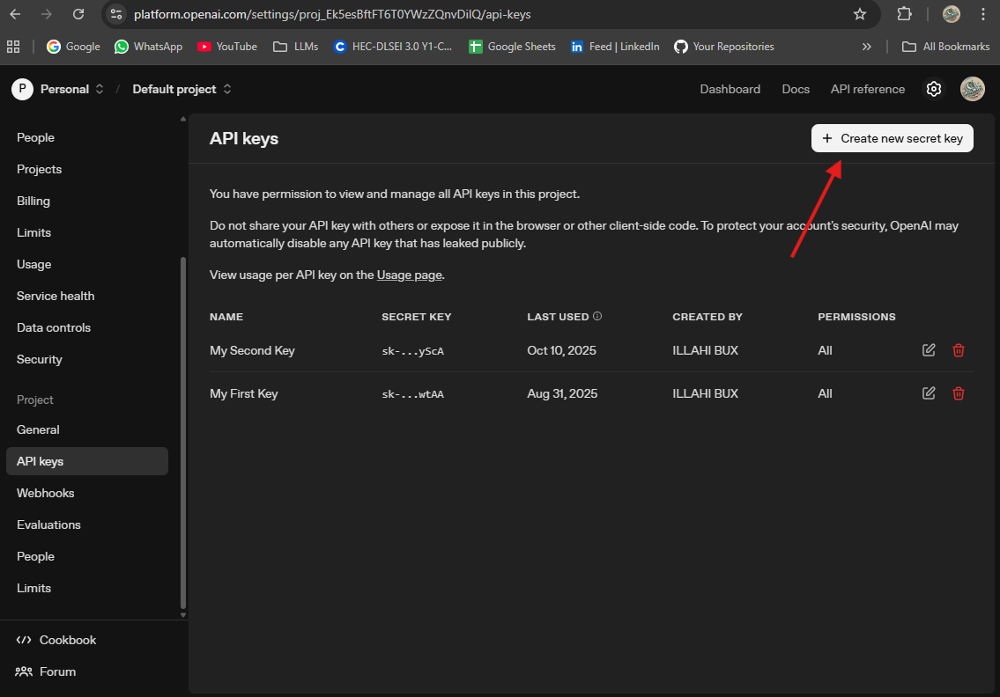
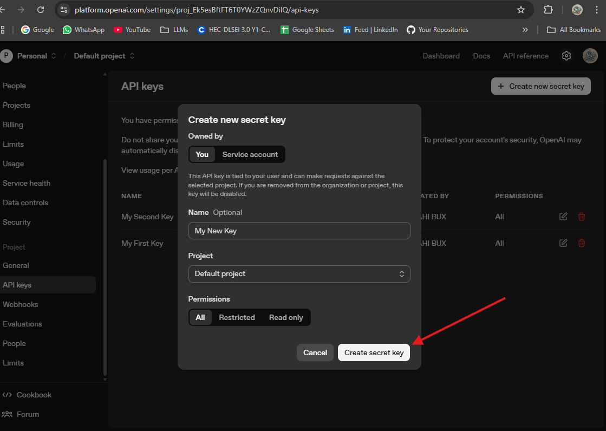

## 🔑 Getting an OpenAI API Key

OpenAI provides access to powerful models like **GPT-5**, **GPT-4** **GPT-4o-mini** and more via its API.  
Follow the steps below to generate your own API key:

---

## 🪜 Step-by-Step Guide

### 🧭 1. Sign Up or Log In
- Go to the OpenAI Platform [**https://platform.openai.com**](https://platform.openai.com/).  
- Create a **free account** or **log in** if you already have one.

---

### ⚙️ 2. Navigate to API Keys
- After logging in, click **⚙️ Settings** near your  **profile icon** .  
- Select **"API keys"**  
- Or directly visit 👉 [https://platform.openai.com/api-keys](https://platform.openai.com/api-keys)

---

 

### 🧩 3. Create a New API Key
- Click the **➕ "Create new secret key"** button.  
- (Optional) Give your key a name for easy identification.  
- Copy the generated key and **store it somewhere safe** — you **won’t be able to view it again!**

---
 
## 💳 Adding a Payment Method (OpenAI) — Step-by-step

Before you can use the OpenAI API , you need to add a payment method (usually a credit or debit card).  
Follow these simple steps.

---

---

### 🪜 Step 1 Navigate to Billing
1. Go to the OpenAI platform and **log in**: (OpenAI Platform)  
### ⚙️ 
- After logging in, click **⚙️ Settings** near your  **profile icon** .  
- Select **"Billing"**  
- Or directly visit 👉 [https://platform.openai.com/settings/organization/billing/overview](https://platform.openai.com/settings/organization/billing/overview)

---

### Step 2 — Add a new payment method (card)
1. Click **Add payment method** or **+ Add**.  
2. Enter your **card number**, **expiry date**, **CVV**, and **billing address**.   
3. Save / Submit.

**Tip:** 
SadaPay platform is good if you do not have Bank credit Card

---

---

✅ **You’re all set!**  
You can now use your API key in your OpenAI Agents SDK-based projects.
